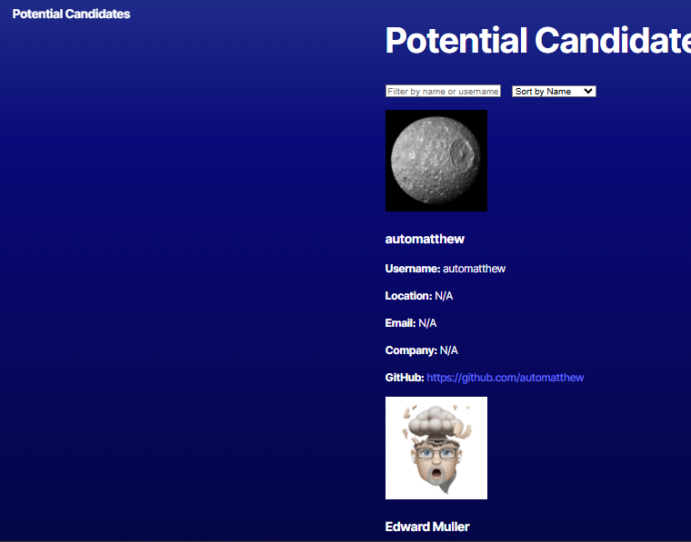

# API-Candidate-Search

## Description
The API Candidate Search application uses TypeScript to call the application's API, then deploys the entire application to Render. This  application allows the user to browse through candidates and add/store the candidates the user see as potential candidates. 





## Installation
```
The Installation entailed using React, API, Typescript, Github, Render

## Usage
```
The usage of this application allows users to browser and search through candidate github accounts and displays their Github information. Also, displays the candiates avatar, email, HTML and company name. The user able to click on a '+ or "-" button with the plus "+" button allowing the user to save the candidate within their potential candidate page.  

```
## Contributing

Users can contact me to discuss the potential candidates inerested in pursusing for team building opportunites. 

## Tests
```test included running terminal commands NPM I, NPM run build and NPM run start for the application website to launch open to be able to view the candidate search and the + or - buttons, can also navigate to the potential candidate page as well. 
```

## Contact and Github information

For any questions, contact me at [via Email](mailto:dreamgardens24@gmail.com).  
GitHub: [Miyako24](https://github.com/Miyako24/API-Candidate-Search) # API-Candidate-Search
Render: [Miyako24]() # 